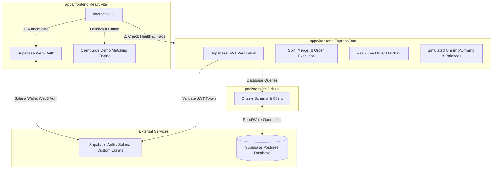

# Predictify: Prediction Market Platform

Predictify is a high-performance, modern prediction market platform (similar to Polymarket) built on a monorepo architecture. It allows users to authenticate using their Solana wallets and trade on future event outcomes using USD.

The codebase is organized as a Turborepo monorepo, using Bun as the package manager and runtime, Drizzle ORM for database operations, and Supabase Postgres for persistence and auth. It features a unique **dual-mode architecture** that automatically switches between a live production backend and a fully functional client-side simulation (Demo Mode) based on backend API availability.

---

## 🏗 Repository Architecture



## Tech Stack
 
| Layer | Technology |
|---|---|
| Frontend | React 19, Vite, TypeScript, Supabase JS |
| Backend | Express 5, Bun runtime, TypeScript |
| Database | PostgreSQL via Drizzle ORM |
| Auth | Supabase (Web3 wallet-based) |
| Monorepo | Turborepo + Bun workspaces |
| Deployment | Backen: Railway (Nixpacks), Frontend: Vercel |
 
---
 

### Monorepo Structure

```
predictify/
├── apps/
│   ├── frontend/         # React + Vite client-side trading dashboard
│   └── backend/          # Express.js backend services & Matching Engine
├── packages/
│   ├── db/               # Shared Drizzle ORM schemas, migration setup, and client
│   ├── ui/               # Shared UI component workspace stub
│   ├── eslint-config/    # Monorepo-wide ESLint configurations
│   └── typescript-config/# Shared TSConfig rules
├── package.json          # Root Monorepo configuration
├── turbo.json            # Turborepo task runner configuration
└── bun.lock              # Lockfile for Bun package manager
```

---

## ⚙️ Prerequisites & Setup

### Requirements

- **Node.js** >= 18 or **Bun** >= 1.1.0 (Bun is highly recommended and used by default in CLI scripts)
- **Supabase Account** with a PostgreSQL database instance and Web3/Solana Auth provider configured.

### Environment Configuration

Ensure you configure the `.env` files in each workspace before starting:

| Directory       | Filename | Environment Variables Required                                    |
| :-------------- | :------- | :---------------------------------------------------------------- |
| `packages/db`   | `.env`   | `DATABASE_URL` (Direct/Pooler PostgreSQL connection string)       |
| `apps/backend`  | `.env`   | `DATABASE_URL`, `SUPABASE_SECRET_KEY`, `VITE_SUPABASE_URL`        |
| `apps/frontend` | `.env`   | `VITE_SUPABASE_URL`, `VITE_SUPABASE_ANON_KEY`, `VITE_BACKEND_URL` |

> [!NOTE]
> For local development, `VITE_BACKEND_URL` in the frontend can be set to `http://localhost:3000`.

---

## 🚀 Running the Project

Install all dependencies in the monorepo from the root directory:

```bash
bun install
```

### Development

Start the frontend, backend, and build shared workspaces in watch mode simultaneously:

```bash
bun dev
```

- **Frontend Dashboard:** [http://localhost:5173](http://localhost:5173)
- **Backend API:** [http://localhost:3000](http://localhost:3000)

### Production Build

Build all apps and packages in the workspace:

```bash
bun run build
```

### Code Formatting & Type Checks

Run prettier formatting across all packages:

```bash
bun run format
```

Run TypeScript compiler type checks for the entire workspace:

```bash
bun run check-types
```

---

## 📂 Packages Overview

### 1. Backend (`apps/backend`)

An Express server powered by Bun that handles user registrations, live balance adjustments, simulated fiat onramps/offramps, market details, order history logging, and the core **Matching Engine**.
_Refer to [apps/backend/README.md](./apps/backend/README.md) for endpoint details and design documentation._

### 2. Frontend (`apps/frontend`)

A beautiful, responsive React trading dashboard showcasing implied Yes/No price probabilities, orderbooks, and portfolio tracking. The client features an offline-first capability that simulates order matching, splits, merges, deposits, and withdrawals inside `localStorage` if it cannot reach the backend.
_Refer to [apps/frontend/README.md](./apps/frontend/README.md) for UI features and local matching simulation details._

### 3. Shared Database (`packages/db`)

Defines the database schema using Drizzle ORM.

- **`users`**: Maps Supabase verified Solana wallet addresses to internal user IDs and maintains USD balances (stored as integers in cents).
- **`markets`**: Event contracts with titles, descriptions, status/resolutions, and YES/NO ask books stored as structured JSON.
- **`positions`**: Tracks how many Yes or No shares of a given market a user holds.
- **`orderHistory`**: Audit trail of all transactions (Buy, Sell, Split, Merge, Onramp, Offramp).

To generate migrations or seed the database, run these commands inside the `packages/db` directory:

```bash
# Generate database schema migrations
bunx drizzle-kit generate

# Run migrations against live DB
bunx drizzle-kit migrate

# Seed dummy markets (e.g. BTC $150k, GPT-5, Mars Landing)
bun run seed.ts
```

---

## 🧠 Core Prediction Market Mechanics

### Market Pricing & Shares

Every prediction market is centered around a question that resolves to either **Yes** or **No**.

1. The combined price of one **Yes** share and one **No** share is always **$1.00 (100 cents)**.
2. Holding a winning share pays out **$1.00** upon resolution; holding a losing share pays out **$0.00**.

### Split & Merge Actions

To ensure liquidity, Predictify supports split and merge operations:

- **Split**: Users can spend **$1.00 USD** cash to generate **1 YES share** and **1 NO share** of any market.
- **Merge**: Users can redeem **1 YES share** and **1 NO share** simultaneously to recover **$1.00 USD** cash.

### Implied Probability & Orderbooks

The matching engine works strictly with **Ask (sell) Orderbooks** for YES and NO outcomes:

- An ask to sell YES at `P` cents is equivalent to an implied bid to buy NO at `100 - P` cents.
- The application synthesizes Yes and No bid/ask spreads automatically by crossing orderbooks, generating a dynamic market spread.

---

## 📝 License

This project is private and proprietary.
